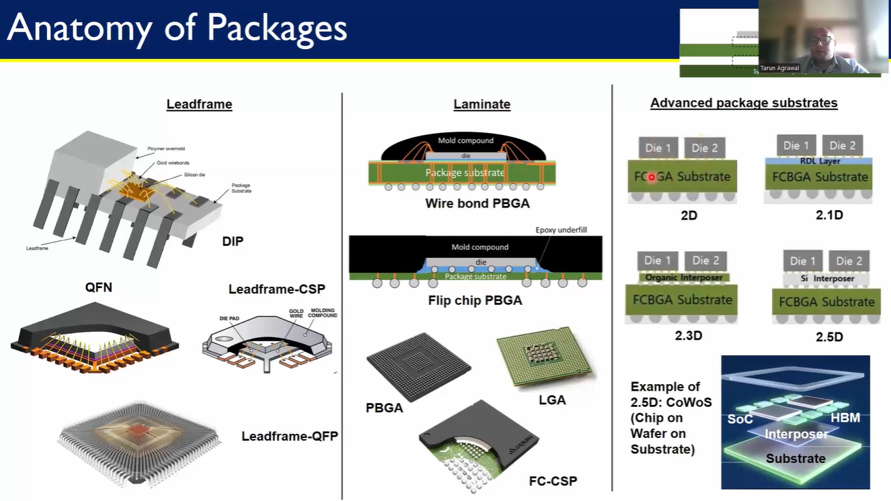
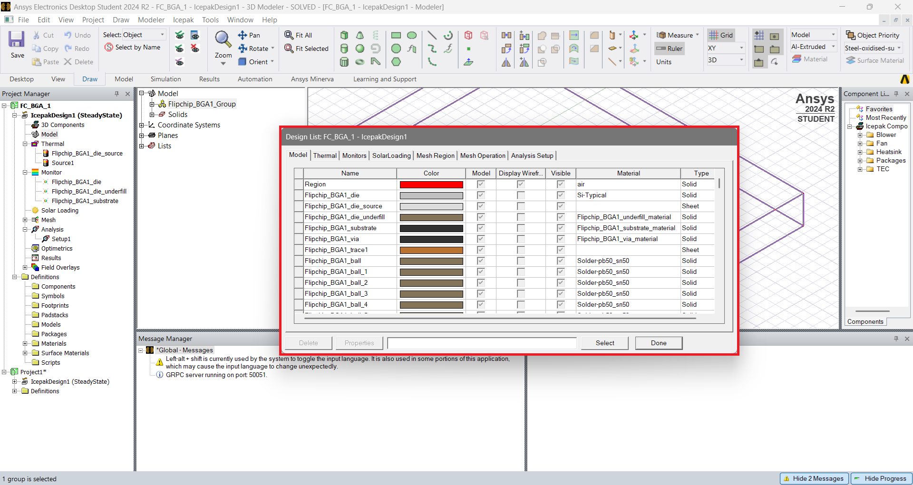
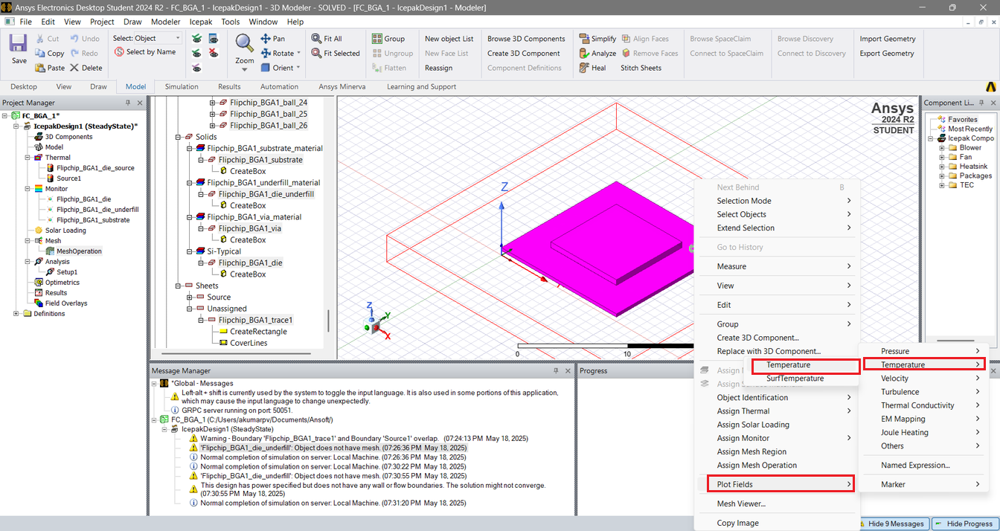

# Semiconductor Packaging
This GitHub repository documents the [Semiconductor Packaging - Fundamentals of Design and Testing 10-days Workshop](https://www.vlsisystemdesign.com/packaging/) offered by [VSD Corp. Pvt. Ltd.](https://www.vlsisystemdesign.com/about-us/) attended from 9-20 May, 2025.  

The workshop offers a full-pipeline understanding of the semiconductor packaging process, starting from the fundamentals and evolution of packaging to advanced 2.5D/3D architectures. We gain insights into advanced interconnect technologies, RDLs & interposers,  assembly processes, package reliability analysis, and also get to perform hands-on thermal simulations, package design and modeling using ANSYS tools.
 

**Table of Contents**

 | Module # | Topic(s) Covered | Status |
 |---|---|---|
 |[**Mod. 1**](#1---packaging-evolution-from-basics-to-3d-integration) | **Packaging Evolution: From Basics to 3D Integration**   <ol> <li>[Introduction To Semiconductor Packaging And Industry Overview](#11---introduction-to-semiconductor-packaging-and-industry-overview)</li> <li>[Understanding Package Requirements And Foundational Package Types](#12---understanding-package-requirements-and-foundational-package-types)</li> <li>[Evolving Package Architectures - From Single Chip To Multi-Chip Modules](#13---evolving-package-architectures---from-single-chip-to-multi-chip-modules)</li> <li>[Interposers Re-distribution Layers And 2.5D/3D Packaging Approaches](#14---interposers-re-distribution-layers-and-25d3d-packaging-approaches)</li> <li>[Comparative Analysis And Selecting The Right Packaging Solution](#15---comparative-analysis-and-selecting-the-right-packaging-solution)</li> </ol> |  |
 |[**Mod. 2**](#2---from-wafer-to-package-assembly-and-manufacturing-essentials) | **From Wafer to Package: Assembly and Manufacturing Essentials**   <ol> <li>[Setting The Stage - Supply Chain And Facilities](#21---setting-the-stage---supply-chain-and-facilities)</li> <li>[Wafer Pre-Preparation - Grinding And Dicing](#22---wafer-pre-preparation---grinding-and-dicing)</li><li>[Wire Bond Packaging - Die Attach To Molding](#23---wire-bond-packaging---die-attach-to-molding)</li> <li>[Flip Chip Assembly - Bump Formation And Underfill](#24---flip-chip-assembly---bump-formation-and-underfill)</li> <li>[Wafer Level Packaging And Conclusion](#25---wafer-level-packaging-and-conclusion)</li> </ol> |    Pending: Documentation |
 |[**Mod. 3**](#3---labs-thermal-simulation-of-semiconductor-packages-with-ansys) | **Labs: Thermal Simulation of Semiconductor Packages with ANSYS**   <ol> <li>[Introduction And Getting Started With ANSYS Electronics Desktop](#31---introduction-and-getting-started-with-ansys-electronics-desktop)</li> <li>[Setting Up A Flip-Chip BGA Package](#32---setting-up-a-flip-chip-bga-package)</li> <li>[Material Definitions And Thermal Power Sources](#33---material-definitions-and-thermal-power-sources)</li> <li>[Meshing And Running The Thermal Analysis](#34---meshing-and-running-the-thermal-analysis)</li> <li>[Viewing Results And Exploring Other Package Types](#35---viewing-results-and-exploring-other-package-types)</li> </ol> |    Pending: Documentation |
 |[**Mod. 4**](#4---ensuring-package-reliability-testing-and-performance-validation) | **Ensuring Package Reliability: Testing and Performance Validation**   <ol> <li>[Introduction to Package Testing and Electrical Functionality Checks](#41---introduction-to-package-testing-and-electrical-functionality-checks)</li> <li>[Reliability and Performance Testing of Semiconductor Packages](#42---reliability-and-performance-testing-of-semiconductor-pack--ages)</li> </ol> |     Pending: Documentation |
 |[**Mod. 5**](#5---package-design-and-modeling-building-a-semiconductor-package-from-scratch) | **Package Design and Modeling: Building a Semiconductor Package from Scratch**   <ol> <li>[Introduction to Package Cross-Section Modeling in ANSYS Electronics Desktop (AEDT)](#51---introduction-to-package-cross-section-modeling-in-ansys-electronics-desktop-aedt)</li> <li>[Creating the Die and Substrate in AEDT](#52---creating-the-die-and-substrate-in-aedt)</li> <li>[Adding Die Attach Material and Bond Pads](#53---adding-die-attach-material-and-bond-pads)</li> <li>[Wire Bond Creation and Material Assignment](#54---wire-bond-creation-and-material-assignment)</li> <li>[Applying Mold Compound and Finalizing the Package Model](#55---applying-mold-compound-and-finalizing-the-package-model)</li> </ol> |  |

## 1 - Packaging Evolution: From Basics to 3D Integration
Semiconductor packaging refers to the final stage of semiconductor device fabrication, where the finished semiconductor die is enclosed in a protective package that allows it to be integrated into electronic systems.
**_Basically, the package helps transition a fragile silicon die fabricated in a foundry cleanroom into the real-world system/ product._**

The key Functions of semiconductor package are:
  1. **Protection** from external environmental (physical/ mechanical damage, humidity, corrosion/ contaminants & chemical damage and ESD)
  2. **Electrical connectivity** between the die and the external environment via leads (pins, balls or lands)
  3. **Mechanical support and connection** of the die to the system
  4. **Thermal dissipation** to conduct heat away from the die

### 1.1 - Introduction To Semiconductor Packaging And Industry Overview
 

|  |
|:---:|

The semiconductor manufacturing process consists of the front-end process which refers to the wafer manufacturing and the back-end process which consists of packaging and testing. (Even the wafer manufacturing process is split into a front-end and back-end process - with the front-end typically consisting of the CMOS-making process, and the back-end comprising the metal wiring formation process that comes after the CMOS is made.)

The following figure is a flow chart that shows the relationship between the semiconductor manufacturing process and the semiconductor industry. The first phase of the packaging and testing process is wafer testing. Afterwards, packages are made in the packaging process and followed by the package test stage.  

|  |
|:---:|

_Ref:_ [_SK Hynix Newsroom: Semiconductor Back-End Process Episode 3_](https://news.skhynix.com/semiconductor-back-end-process-episode-1-understanding-semiconductor-testing/)

  - Companies like Nvidia, Qualcomm and Apple that only design semiconductors are called “fabless.”
  - Products designed by fabless companies are made into wafers, and the facilities that produce these wafers are called “foundries.” Global companies with these facilities include TSMC, Global Foundries and UMC.
  - Then, there are companies that test and package products that were designed by fabless vendors and, later, made into wafers at foundries. These are called OSAT (Out-Sourced Assembly and Test) which include companies such as ASE and Amkor.
  - Finally, there are the companies that do everything from design, wafer production, and packaging, to testing. These companies are called IDMs (Integrated Device Manufacturer).

### 1.2 - Understanding Package Requirements And Foundational Package Types
#### 1.2.1 - Package Requirements
Selecting the right semiconductor package is a critical step in electronic system design, as it affects performance, cost, thermal management, size, and reliability. 

|  |
|:---:|

The criteria for semiconductor package selection generally fall into the following key categories:
  - **Application-specific Requirements**
    - Logic/ Memory die
    - Power semiconductor die)
  - **Electrical Requirements**
    - I/O Pin Count
    - Signal Integrity for high speed I/Os
    - Power Delivery
  - **Thermal Requirements**
    - Thermal Dissipation
    - Operating Temperature Range
  - **Mechanical and Physical constraints**
    - Form Factor: Footprint and chip height requirements for the system
    - System Integration needs: MCM, SiP, 2.5/3D packaging for tighter integration
  - **Cost Considerations**
    - Package cost
    - Board/ System Assembly cost
  - **Reliability and Durability**
    - Mechanical stress
    - Thermal cycling
    - Moisture and other environmental factors

#### 1.2.2 - Typical Package Structure
The following figure below shows the structure of a typical chip package and the connection hierarchy:

|  |
|:---:|

A typical IC package consists of:
  - **Die**: The semiconductor die itself.
  - **Carrier**: Intermediate structure for routing and support.
  - **PCB (System Board)**: Final mounting platform where the packaged IC is installed/ soldered.
  - **Mold Compound**: Protects the die from environmental damage.

Mounting Technologies:
  - **Through-hole Mounting**
    - TO : Transistor Outline
    - SIP : Single In-line Package
    - DIP : Dual In-line Package
    - PGA : Pin Grid Array
  - **Surface Mount Technology**:
    - (T)SOT : (Thin) Small Outline Transistor
    - (T)SOP : (Thin) Small Outline Package
    - SOIC : Small Outline IC Package
    - QFN : Quad Flat No-leads
    - QFP : Quad Flat Package
    - PBGA : Plastic Ball Grid Array
    - LGA : Land Grid Array
    - FCBGA : Flip Chip Ball Grid Array
    - CSP : Chip Scale Package
  - **Advanced Packages**
    - PoP : Package on Package (Qualcomm SD series, Apple A-Series, Samsung Exynos etc.)
    - MCM : Multi-Chip Module (eg: Intel Broadwell)
    - SiP : System-in-Package (Apple S1)
    - CoWoS : Chip on Wafer on Substrate (eg: Nvidia GP100, GV100, GA100, etc.)

### 1.3 - Evolving Package Architectures - From Single Chip To Multi-Chip Modules
#### 1.3.1 Classification and Anatomy of Semiconductor Packages

The various types of semiconductor packages can be broadly grouped into two main categories:
  - Conventional Packages
  - Wafer-level packages

In conventional packaging, the wafer is sawed into dice before the chip is packaged, while wafer-level packaging involves a part, or all, of the packaging process being performed at the wafer level before proceeding with wafer sawing.

|  |
|:---|
| _Ref:_ [_SK Hynix Newsroom: Semiconductor Back-End Process Episode 3_](https://news.skhynix.com/semiconductor-back-end-process-episode-3-understanding-the-different-types-of-semiconductor-packages/)_ |

Depending on the medium of the package, packages can be further categorized into leadframe and laminate packages.
  - **Leadframe-Based Packages**
    - **DIP**: Traditional, with wirebonds and external leads
    - **QFN**: Compact with exposed thermal pads
    - **Leadframe CSP & QFP**: Scaled for density and SMT

  - **Laminate-Based Packages**
    - **PBGA**: Wirebonded to laminated substrates
    - **Flip Chip PBGA**: Superior signal and thermal performance
    - **LGA, FCCSP**: Common in modern devices

  - **Advanced Substrates**
    - **2D**: Dies placed side-by-side on the same substrate
    - **2.1D**: Adds RDL for better routing
    - **2.3D**: Uses organic interposers
    - **2.5D**: Silicon interposer for high-speed interconnects (e.g.: CoWoS)

The below figure shows the anatomy of some of the commonly used leadframe and laminate based packages and advanced substrates:

|  |
|:---|

### 1.4 - Interposers, RDLs And 2.5D/3D Packaging Approaches

|  |
|:---|

#### 1.4.1 - Redistribution Layers (RDL)
RDL (Redistribution Layer) is a metal layer added on top of a die or wafer to reroute the I/O pads to new locations. This enables more flexible bump layouts, especially important for fan-out packages or wafer-level chip scale packaging (WLCSP).

  - Applications
    - Fan-out wafer-level packaging (FO-WLP, FO-BGA)
    - Panel-level packaging (PLP)
    - Multi-die integration
    - System-in-Package (SiP)

  - Advantages:
    - Allows larger bump pitch for finer pad layouts
    - Reduces package size and thickness
    - Enables multi-chip placement and interconnect on a single substrate

#### 1.4.2 - Interposers
An interposer is a passive or active layer inserted between the die and the substrate, acting as an intermediate routing interface. It enables dense signal routing, power delivery, and die-to-die interconnect.

  - Types: Silicon, Organic, Glass

  -  Functions:
    - Routes signals between multiple dies (e.g., chiplets)
    - Provides thermal expansion management
    - Enables high bandwidth communication

  - Passive vs. Active Interposers:
    - Passive: No logic, just routing and vias
    - Active: Includes power delivery, clocking, or even memory logic

#### 1.4.3 - 2.5D/3D Integration
  - **2.5D**: Multiple dies (e.g., CPU + HBM) placed side-by-side on a common interposer. Interposer provides connectivity, not the substrate directly. Popular in HPC and AI (e.g., AMD Instinct, NVIDIA GPUs with HBM).
  - **3D**: Dies are stacked vertically, interconnected through Through-Silicon Vias (TSVs). 3D NAND, HBM memory stacks, logic-on-logic stacking.

### 1.5 - Comparative Analysis And Selecting The Right Packaging Solution
The following table provides a comparison of the various IC package types and their typical applications:

|  |
|:---|

Selecting the right semiconductor packaging depends on multiple criteria across performance, reliability, form factor and cost.
_________________________________________________________________________________________________________  

## 2 - From Wafer to Package: Assembly and Manufacturing Essentials
This section covers the semiconductor supply chain and provides a detailed look into a package manufacturing unit (**ATMP** – Assembly, Testing, Marking, and Packaging).

### 2.1 - Setting The Stage - Supply Chain And Facilities
#### 2.1.1 - Semiconductor Supply Chain Overview
The semiconductor supply chain is a multi-step process that transforms raw silicon into fully functional electronic products. The major steps are:

  - 1. **Design** : Chip design and verification using EDA tools and .
    - **Inputs**: Product requirements specification, EDA tools, Foundry PDKs, IPs
    - **Output**: GDSII layout file is **_taped out_** to the foundry for mask creation and wafer fabrication. Test programs are also provided by the Design house for Wafer and Package level testing.
    - Examples: Nvidia, AMD, MediaTek, Intel, TI, Apple, ARM etc.
  
  - 2. **Wafer Fabrication (Foundry)** : Physical ICs are manufactured onto wafers using photolithography and other processes.
    - **Input**: GDSII layout, Silicon wafers, Equipment, Gases, chemicals, Materials
    - **Output**: Processed wafers with patterned dies
    - Examples: TSMC, Samsung, Intel, GlobalFoundries
  
  - 3. **Packaging Assembly & Test** : ICs are cut (diced), bonded, encapsulated, and tested
    - **Input**: Test programs, Singulated dies, substrate materials (e.g., ABF, BT resin), solder bumps
    - **Output**: Packaged IC (e.g., BGA, QFN, FCBGA, 2.5D/3D)
    - Examples: ASE, Amkor, JCET, Shinko, Ibiden
  
  - 4. **Board Assembly & Test** : Multiple packaged ICs are mounted and board-level validation.
    - **Input**: Packaged ICs, test programs, ATE systems
    - **Process**: Functional and parametric testing, burn-in, sorting
    - **Output**: Qualified ICs, binned by performance. Yield improvement and binning are critical for profitability.
    - Examples: ASE, Powertech, Amkor, UTAC

  - 5. **System Integration & Distribution**
    - **Input**: Packaged, tested ICs; PCBs; passive components
    - **Process**: SMT assembly, system-level integration, validation
    - **Output**: Complete electronic systems (e.g., smartphones, servers)
    - Examples: OEMs Original Equipment Manufacturer (Apple, Cisco), ODMs Original Design Manufacturer (Foxconn, Pegatron), EMS Electronics Manufacturing Services (Flex, Jabil)

### 2.2 - Wafer Pre-Preparation - Grinding And Dicing
### 2.3 - Wire Bond Packaging - Die Attach To Molding
### 2.4 - Flip Chip Assembly - Bump Formation And Underfill
### 2.5 - Wafer Level Packaging And Conclusion

_________________________________________________________________________________________________________  

## 3 - Labs: Thermal Simulation of Semiconductor Packages with ANSYS tools

### 3.1 - Introduction And Getting Started With ANSYS Electronics Desktop

ANSYS Electronics Desktop (AEDT) is a multi-physics simulation software that combines Electromagnetic, Signal Integrity, Thermal and Electro-Mechanical simulation tools in a single integrated platform. It is widely used for designing and analyzing high-speed electronic circuits and systems.

### 3.2 - Setting Up A Flip-Chip BGA Package

We will be taking an already available FC-BGA package within the Icepak Toolkit for this simulation exercise.

  - **Step 1 : Open AEDT and launch Icepak**
|  |
|:---|

  - **Step 2.1 : Create a Flipchip BGA Package**
    - `Icepak -> Toolkit -> Geometry -> Packages -> Flipchip_BGA`

|  |
|:---|

  - **Step 2.2 : The Package Configuration window opens up**
    - The dimensions and other aspects of the package, substrate, die, die underfill and the solder balls can be configured here.
    - Once configured, click OK to generate the package model. 

|  |  |
|:---|:---|
|  |  |

| Package generated in Icepak    |
|:---|

  - **Step 3 : Explore the 3D Package Model Structure in Icepak**

| **Ball Group**    | **Substrate**    |
|:---|:---|
| **Die Underfill**    | **Die**    |

### 3.3 - Material Definitions And Thermal Power Sources
  - **Step 4 : Review and modify the material and definition types for the different components of the model.**

| Material Definitions    |
|:---|

  - **Step 5.1 : Add/ Assign Source Thermal Model for Die**
    - In "Project Manager" sub-window, expand Thermal section and open the **_BGA1_die_source_** and configure the thermal condition as shown below:

| Source Thermal Model for Die    |
|:---|

- **Step 5.2 : Add/ Assign Source Thermal Model for Substrate**
    - To add a thermal boundary condition for the substrate, right click on **_Flipchip_BGA1_substrate_** under `Models -> Flipchip_BGA1_Group -> Solids` and assign a Thermal Source.
    - Set the thermal condition on the substrate to Fixed Temperatue and the temperature as Ambient.

| Add Source Thermal Model for Substrate    |  |
|:---|:---|

  - **Step 6 : Add Thermal monitors for the different components**
    - To add a Thermal monitor to the substrate, right click on the **_Flipchip_BGA1_substrate_** under `Models -> Flipchip_BGA1_Group -> Solids` and then choose `Assign Monitor -> Point...`
    - In the sub-window that appears, select **Temperature**
    - Repeat the same to add thermal monitors for the die and the die-underfill.

| Add Thermal monitor for Substrate    |  |
|:---|:---|

| Thermal monitors added    |
|:---|

### 3.4 - Meshing And Running The Thermal Analysis

  - **Step 7.1 : Generate Mesh**
    - Go to the Simulation tab and click on `Generate Mesh`
    - Save the project if prompted and wait for the mesh generation to get completed.
    - Take a note of any error(s) and warning(s) that are shown and ignore/ take steps to debug & fix the issue(s) as required.

  - **Step 7.2 : Review Mesh Quality metrics**
    - Once the mesh is generated, review the quality metrics of the generated mesh such as Face Alignment, Skewness and Volume.

| **Mesh Generation**    |
|:---|

| **Mesh Quality - Face Alignment**  | **Mesh Quality - Skewness**  |
|:---|:---|
| **Mesh Quality - Volume**  | |

  - **Step 8 : Add Thermal Analysis**
    - Under `Project Manager`, right click on `Analysis -> then, select Add Analysis Setup` and configure the solver settings as required. (We will choose all default settings for our analysis)

| **Add Analysis Setup**    |
|:---|

### 3.5 - Viewing Results And Exploring Other Package Types

  - **Step 9 : Now, Validate the Simulation setup**
    - Click on the **Validate** button in the top ribbon
    - Ensure all checks are validated successfully

| **Validate the setup**    |
|:---|

  - **Step 10: Run the simulation and plot the temperature map**
    - Click on **Analyze All** button in the top ribbon
    - Wait for the simulation to get completed successfully. Take note of any warning(s) or errors that may need further debug or setup modification(s).
    - Once the simulation is completed, select the complete FC-BGA package in the 3D view by drawing a selection rectangle using the left-mouse button.
    - Right click and then select `Plot Fields -> Temperature -> Temperature`
    - Configure the different plot options:
      - Specify Name, Folder
      - Plot on Surface only
      - Surface Smoothing -> Enable Gaussian Smoothing

| **Plot Fields**  | **Field Plot Settings**  |
|:---|:---|
| **Field Plot - Top view**  | **Field Plot - Bottom view**  |

_________________________________________________________________________________________________________  

## 4 - Ensuring Package Reliability: Testing and Performance Validation
### 4.1 - Introduction to Package Testing and Electrical Functionality Checks
### 4.2 - Reliability and Performance Testing of Semiconductor Pack -ages

_________________________________________________________________________________________________________  

## 5 - Package Design and Modeling: Building a Semiconductor Package from Scratch
### 5.1 - Introduction to Package Cross-Section Modeling in ANSYS Electronics Desktop (AEDT)
### 5.2 - Creating the Die and Substrate in AEDT
### 5.3 - Adding Die Attach Material and Bond Pads
### 5.4 - Wire Bond Creation and Material Assignment
### 5.5 - Applying Mold Compound and Finalizing the Package Model

_________________________________________________________________________________________________________  